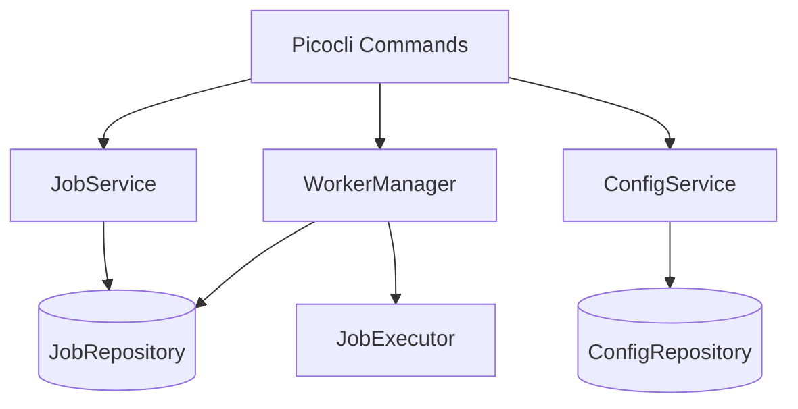
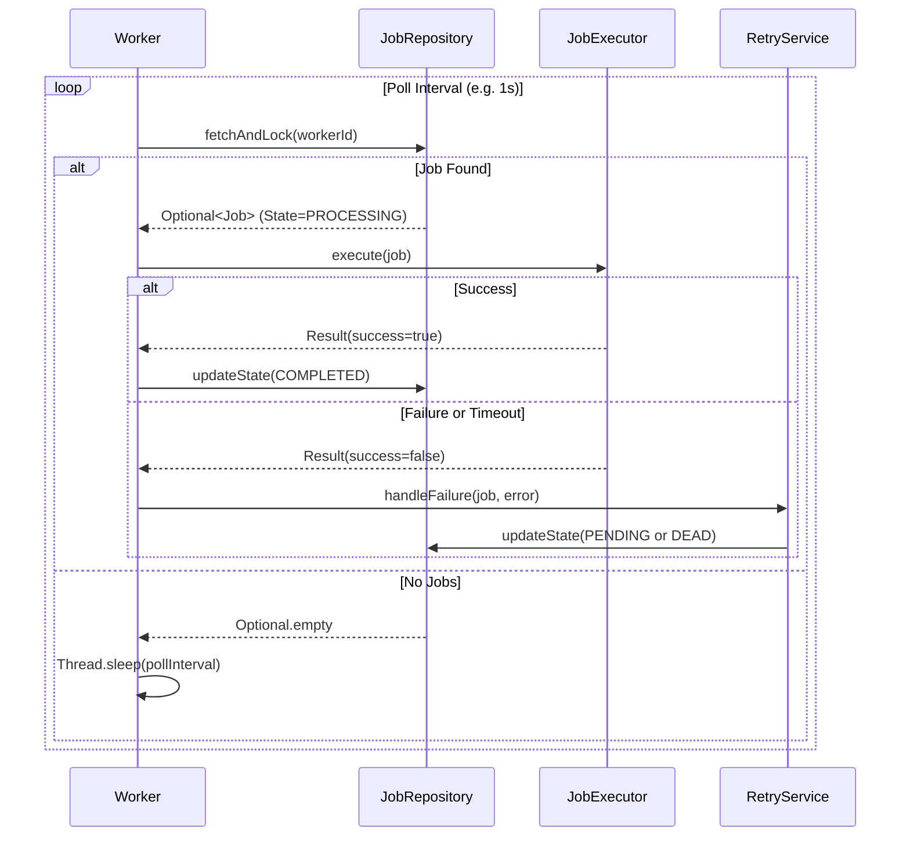
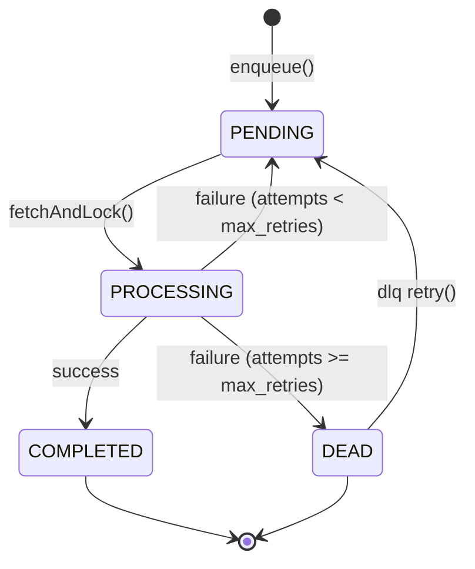
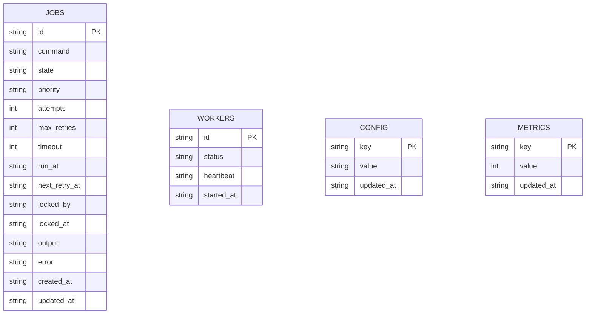

# QueueCTL Architecture

QueueCTL is designed as a standalone, zero-dependency (other than SQLite and Jackson) CLI application. The architecture favors simplicity, atomicity, and self-contained execution over distributed coordination.

## High-Level Architecture

The system is layered in a hexagonal/clean architecture style, meaning the core domain has no dependencies on the framework (CLI) or the database. 

## Worker Execution Flow

Workers run in a threaded `ExecutorService` pool. The poll loop uses atomic fetch-and-lock to ensure jobs are only executed exactly once.

## Job Lifecycle (State Machine)

Jobs move through a strict state machine.

## Database Schema

QueueCTL relies on SQLite for persistent storage. The schema is designed for fast polling.

